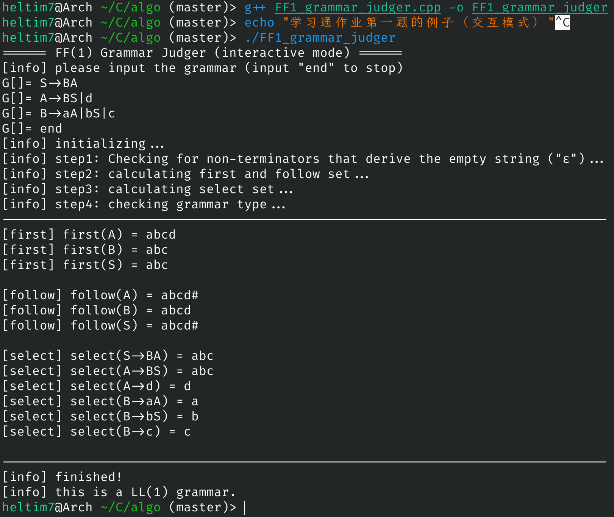
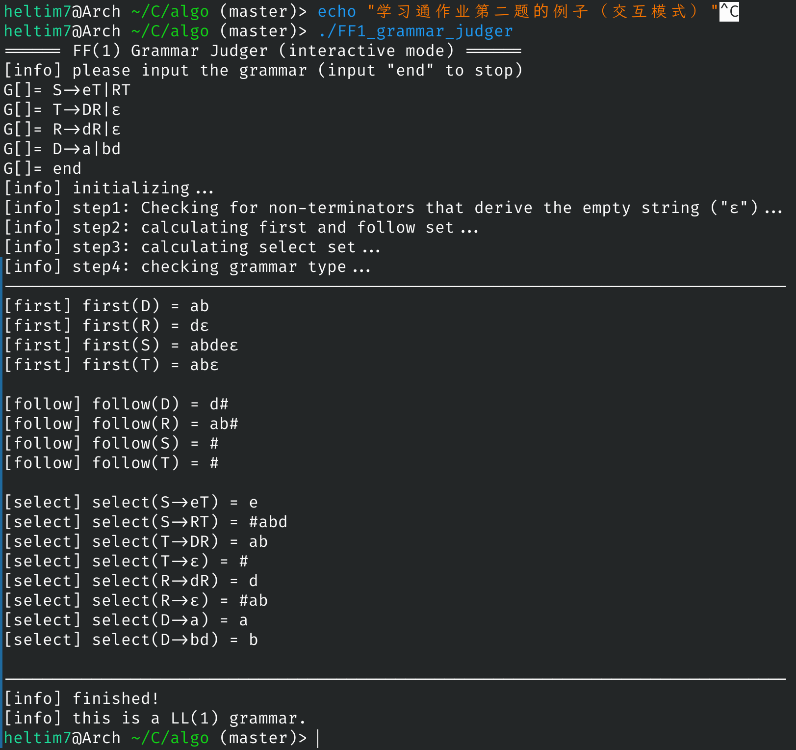
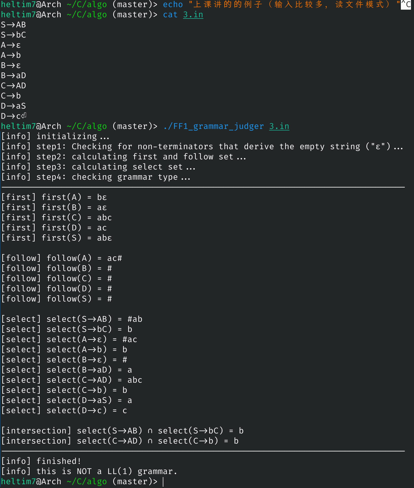

# $FF(1)$ 文法判断

> 计科20-2bj 李居航

分4步判断一个文法是否为$FF(1)$文法，假定文法不包含无用和有害的规则。记输入文本总长度为$|S|$，字符集大小为$|\Sigma|$。

## 效果

在输入量比较少的时候，可以使用交互的输入方式，输入量比较大时可以读文件输入。

在认为字符集大小为常数的前提下，程序可以在线性的时间复杂度内完成$first,follow,select$集的计算。

在计算完$first,follow,select$集之后，程序会打印出非空的交集并判断给定的文法是否为$FF(1)$文法。

例子（前两个是$FF(1)$，最后一个不是）：







## 算法

### $step1$ 判断能推出空串的非终结符

使用了与教材略不相同的算法。按照产生式的左部和右部建立二分图，左部向所有该左部出现过的右部节点连边，右部向归属的左部节点连边。将一开始就能确定可以导出空的节点加入队列，跑拓扑排序即可得到结果。

时间复杂度$\mathcal{O}(|S|)$。

#### 实现

```cpp
void check_empty() {
    VI cnt;
    queue<char> q;
    
    for(int i=0;i<gen.size();i++) {
        cnt.push_back(0);
        if(gen[i]==string{empty_char}) q.push(left[i]);
        else {
            for(char x:gen[i]) {
                if(ister(x)) {
                    cnt.back()=-1;
                    break;
                }
                else if(x!=left[i]) cnt.back()++;
            }
        }
    }

    while(q.size()) {
        char u=q.front();
        q.pop();
        if(may_empty[u]) continue;
        may_empty[u]=1;
        for(int v:right[u]) 
            if(--cnt[v]==0) q.push(left[v]);
    }
}
```

### $step2$ 计算$first$集和$follow$集

采用教材介绍的关系图法（类似上面的拓扑排序），发现$first$集和$follow$集可以同时计算所以合并成一步。

在按照关系图法建好图之后，对于每个终结符，跑$bfs$即可得到结果。具体实现上，$first$集的做法和教材基本相同，但是$follow$集的部分，采用了一些压缩边的方法来保证边的数量为线性。

时间复杂度$\mathcal{O}(|S||\Sigma|)$。

#### 实现

```cpp
void cal_first_follow() {
    vector<VI> adj(2*A);
    vector<bool> mark(2*A);

    auto new_node=[&]() {
        adj.push_back({});
        mark.push_back({});
        return adj.size()-1;
    };

    for(int i=0;i<gen.size();i++) {
        string &s=gen[i];
        debug(i,gen[i]);

        // first
        for(int j=0;j<s.size();j++) {
            adj[s[j]].push_back(left[i]);
            if(ister(s[j])||!may_empty[s[j]]) break;
        }

        // follow
        for(int j=s.size()-1;j>=0;j--) {
            if(noter(s[j])) adj[left[i]+A].push_back(s[j]+A);
            if(!may_empty[s[j]]) break;
        }
        for(int j=1,pre=0;j<s.size();j++) {
            if(may_empty[s[j]]) {
                int cur=new_node();
                adj[s[j]].push_back(cur);
                if(pre) adj[cur].push_back(pre);
                if(noter(s[j-1])) adj[cur].push_back(s[j-1]+A);
                pre=cur;
            }
            else {
                if(noter(s[j-1])) adj[s[j]].push_back(s[j-1]+A);
                if(pre) adj[s[j]].push_back(pre);
                pre=0;
            }
        }
    }
    adj['#'].push_back('S'+A);

    auto bfs=[&](char c) {
        queue<int> q;
        mark=vector<bool>(mark.size());
        q.push(c);
        while(q.size()) {
            int u=q.front();
            q.pop();
            for(int v:adj[u]) {
                if(!mark[v]) {
                    mark[v]=1;
                    if(v<=A) first[v].push_back(c);
                    else if(v<=2*A) follow[v-A].push_back(c);
                    q.push(v);
                }
            }
        }
    };

    for(int i='a';i<='z';i++) bfs(i);
    bfs('#');
    for(int i='A';i<='Z';i++) if(may_empty[i]) first[i].push_back('.');
}
```

### $step3$ 计算$select$集

在计算出$first$和$follow$集后，使用定义法分类讨论计算$select$集。

使用```std::set```判重，时间复杂度$\mathcal{O}(|S|\log{|\Sigma|})$。

#### 实现

```cpp
void cal_select() {
    for(int i=0;i<gen.size();i++) {
        string &s=gen[i],ans;
        bool res=1;
        set<char> st;
        for(char c:s) {
            if(c==empty_char) break;
            res&=may_empty[c];
            if(noter(c)) for(char x:first[c]) st.insert(x);
            else st.insert(c);
            if(!res) break;
        }
        if(res) for(char x:follow[left[i]]) st.insert(x);
        st.erase(empty_char);
        for(char x:st) ans.push_back(x);
        select.push_back(ans);

        debug(left[i],gen[i],select.back());
    }
}
```

### $step4$ 计算左部相同的产生式的交集

直接两两枚举所有左部相同的产生式然后暴力判断是否有交集即可，如果存在至少一个非空的交集那么说明这不是$FF(1)$文法，反之是$FF(1)$文法。

如果需要找出所有的交集，这部分的时间复杂度最坏是$\mathcal{O}(|S|^2)$。

#### 实现

```cpp
void check_LL1() {
    bitset<A> a,b;
    for(int i=0;i<gen.size();i++,a.reset()) {
        for(auto x:select[i]) a[x]=1;
        for(int j=i+1;j<gen.size();j++,b.reset()) {
            if(left[i]!=left[j]) continue;
            for(auto x:select[j]) b[x]=1;
            b&=a;
            if(b.any()) {
                LL1=0;
                string res;
                for(int k=0;k<b.size();k++) if(b[k]) res.push_back(k);
            }
        }
    }
}
```

综上所述，算法可以在$\mathcal{O}(|S||\Sigma|)$的时间复杂度内计算出所求的$first,follow,select$集。（教材所介绍的算法中，有几步达到了$\mathcal{O}(|S|^2)$甚至$\mathcal{O}(|S|^3)$的级别）

完整的代码参见附件，需要C++17或者更新的标准编译。