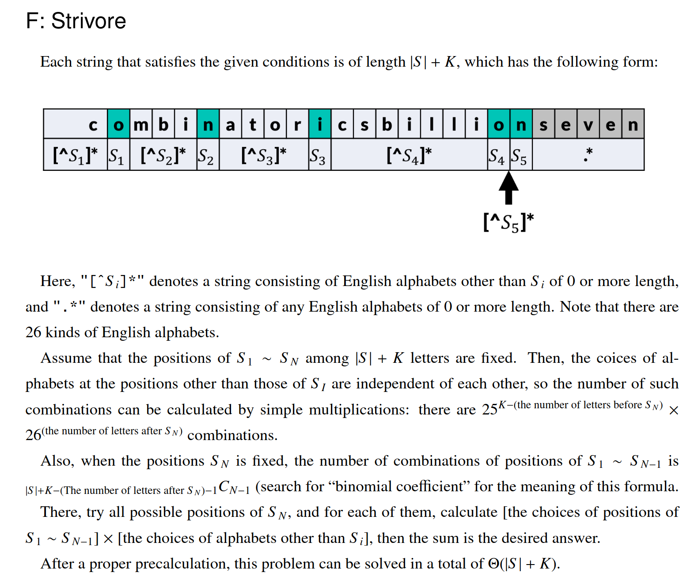

# ABC 171 Problem F Strivore

首先约定一些符号：

- $S$ 表示原串
- $op$ 表示操作序列，即插入的字符序列，$op_i$表示第$i$个字符
- $T$ 表示结果字符串，由$S$通过$op$得到，$|T|=|S|+|op|$

问题在于如何不重不漏的统计。由于我们统计的是$T$的数量，考虑如何在$T$和$op$之间建立合适的对应关系，问题转化为构造一种映射的规则使得$T$集合到$op$集合为单射，但不要求为满射，记为$f$，$op$集合到$T$集合的映射为$g$，$g$不要求为满射，满足$g(f(T))=T$。

构造映射规则：

- $f,T \rightarrow op:$ 
  - 对于一个结果字符串$T$，我们认为它的原串$S$是其能取得的最前的一个子序列：
  - 例如$T=mathistoooohardddd,S=mtod$，那么我们认为原串所在的序列为$[m]a[t]hist[o]ooohar[d]ddd$。
  - 由于原串已经确定，那么我们认为$op$就是除了原串从前往后插入的字符序列
  - 根据定义，当$T$确定时$f(T)$也确定。
- $g,op \rightarrow T$ 
  - 对于一个合法的$op$，$g(op)$显然是唯一确定的，结果串就是按照$op$操作得到的串。
  - 问题在于$g$不一定是满射，根据$f$的映射规则，我们可以逆向构造$g$的映射规则：
  - 令$T$中右侧离$op_i$最近的原串字符为$S_i$，一个$op$合法，当且仅当$op_i \not = S_i$，参考AtCoder的图，青色部分为原串，很形象。
  - 此时$g(op)$能取得的最前一个序列就是$S$原串，即$g(f(T))=T$。

于是我们就可以统计$T$的数量了，根据$g(f(T))=T$，我们只需要统计满足映射规则$op$即可。

参考AtCdoer的图，除了$S_n$之后的那段字符可以任选，前面的每段能选择的字符不能和$S_i$相同，所以一共有25种选择。

对于一个给定的$S$位置，答案就是

$$
ans=25^{S_n前面的串长-n+1} \cdot 26^{S_n后面的串长}
$$

因此我们直接枚举$S_n$的位置，对于每个$S_n$再乘上选择$S_1...S_{n-1}$位置的方案数即可

$$
ans=\sum_{i=1}^{|T|}{\binom{i-1}{n-1}25^{i-n}26^{|T|-i}}
$$

时间复杂度$\mathcal{O}(|S|+K)$。